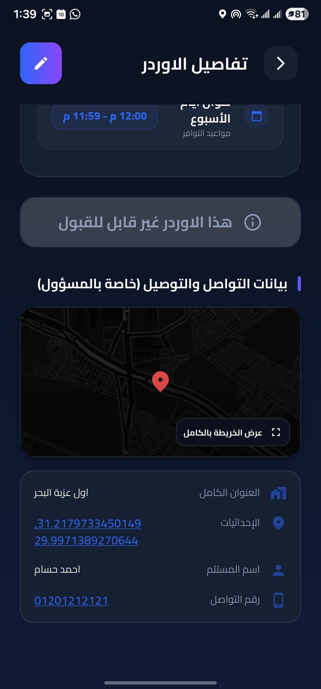

# Scrap Collection Operations System ♻️

**Scrap Collection Operations System** is a real-world mobile operations platform built for scrap collection businesses.
It digitizes the workflow of receiving scrap pickup requests, assigning field workers, and tracking operations using a map-based interface.

The application replaces manual coordination methods (phone calls, spreadsheets, messaging apps) with a centralized system used by administrators and field workers.

---

# 🚀 Project Overview

This system is designed to support the daily logistics workflow of scrap collection companies.

The application manages the entire pickup lifecycle:

1. Customers submit scrap pickup requests.
2. Administrators manage incoming orders.
3. Field workers accept pickup tasks.
4. Workers navigate to pickup locations via an interactive map.
5. Orders are tracked until completion.

The platform focuses on **real-time coordination, operational visibility, and efficient worker dispatching**.

---

# ⚠️ Problem Statement

Many scrap collection businesses rely on informal communication such as:

- Phone calls
- WhatsApp messages
- Paper notes
- Manual order tracking

This leads to several operational challenges:

- Delays in assigning orders to workers
- Limited visibility of active pickups
- Difficulty tracking worker availability
- Disorganized customer data
- Inefficient travel routes between pickups

This system solves these problems by centralizing order management, worker dispatching, and location tracking in one application.

---

# ✨ Key Features

### 📦 Order Management

- Create and manage scrap pickup requests
- Track order status (pending, accepted, completed)
- Automatic priority updates based on waiting time

### 👥 Worker Dispatch

- Assign field workers to pickup orders
- Workers can view and accept available orders
- Worker capacity limits to prevent overload

### 🗺 Interactive Map System

- Display pickup locations on a map
- Show worker GPS location
- Calculate road-based routes using OSRM
- Sort orders based on road distance

### 🔐 Role-Based Access Control

- Separate roles for **admin** and **field workers**
- Secure database access using Supabase **Row Level Security**

### 💰 Transaction Logging

- Record operational transactions
- Track financial adjustments and service usage

### ⏰ Worker Availability

- Weekly availability configuration
- Prevent assignments outside working hours

---

# 🏛 System Architecture

The project follows a **Feature-First Modular Architecture** designed to keep the codebase maintainable and scalable.

### Architecture Layers

**Presentation Layer**

- Flutter UI components
- Riverpod state management
- Feature-based screen modules

**Domain Layer**

- Business models (Orders, Profiles, Transactions)
- Application logic representation

**Data Layer**

- Supabase PostgreSQL backend
- Repository-based data access
- Local caching using Hive

**Service Layer**

- Location tracking
- Routing service integration
- Network connectivity monitoring

This separation allows the project to scale while keeping the code organized.

---

# 🗺 Map & Location System

A central part of the application is the **map-based operational dashboard**.

Capabilities include:

- Real-time worker GPS tracking
- Order markers displayed on the map
- Road-distance routing using **OSRM**
- Map marker clustering for performance
- Edge indicators for off-screen orders

This allows workers to identify nearby pickups and navigate efficiently.

---

# 🧠 Engineering Highlights

- Feature-first Flutter architecture
- Reactive state management with Riverpod
- Real-time backend synchronization with Supabase
- Role-based access control using PostgreSQL RLS
- Map-based order visualization
- Cached routing requests to reduce external API usage
- Modular services for location and routing

---

# 🛠 Tech Stack

### Mobile

Flutter (Material 3)

### State Management

- flutter_riverpod
- state_notifier

### Backend

- Supabase
- PostgreSQL

### Local Storage

- Hive CE
- SharedPreferences
- flutter_secure_storage

### Mapping

- flutter_map
- latlong2
- OSRM API

### UI/UX

- Google Fonts (Cairo)
- Lottie
- Shimmer

---

# 🔐 Security & Authentication

Security is implemented using Supabase authentication and database policies.

Key mechanisms include:

- Secure user authentication
- Role-based access control
- PostgreSQL **Row Level Security**
- Encrypted token storage using `flutter_secure_storage`

---

# 📸 Screenshots

| Dashboard                                          | Map                                                | Orders                                             | Profile                                            |
| -------------------------------------------------- | -------------------------------------------------- | -------------------------------------------------- | -------------------------------------------------- |
|  |  |  |  |

---

# 📈 Future Improvements

Possible future enhancements include:

- Push notifications for new pickup assignments
- Advanced route optimization algorithms
- Worker performance analytics
- Web-based admin dashboard
- Multi-city operational support

---

# 👨‍💻 Author

**Your Name**

GitHub
[https://github.com/iziadehap](https://github.com/iziadehap)

LinkedIn
[linkedin.com/in/iziadehap](https://linkedin.com/in/iziadehap)

---

# 📄 License

This project is shared for **portfolio and demonstration purposes**.
