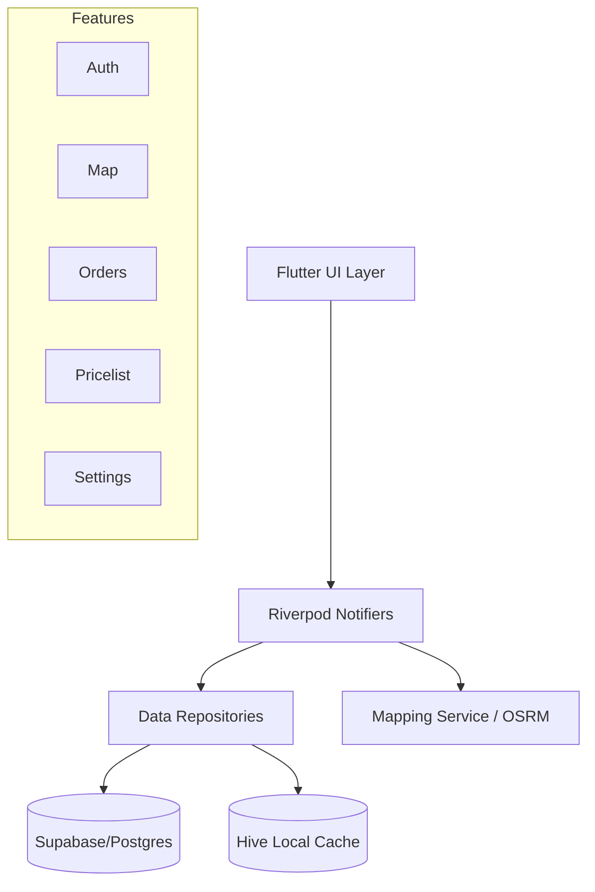

# Scrapekia ♻️

### Enterprise-grade Logistics & Scrap Collection Management System

**Scrapekia** is a production-ready Flutter application developed for a real-world scrap collection company. It streamlines the entire logistics chain—from customer pickup requests and administrative oversight to real-time worker assignment and delivery tracking.

---

## 📖 Project Overview

Scrapekia serves as the primary operational tool for a scrap collection enterprise. It bridges the gap between customers looking to dispose of scrap materials and the logistics team responsible for collection. The system ensures that every request is logged, prioritized, and assigned to the nearest available worker, optimizing the collection route and minimizing operational delays.

## ⚠️ Problem Statement

Traditional scrap collection often suffers from:

- **Inefficient Routing**: Workers manual navigation leading to high fuel costs and time loss.
- **Lack of Transparency**: Customers and admins having no real-time visibility into order status.
- **Assignment Delays**: Difficulty in matching orders with available workers based on proximity and load.
- **Data Fragmentation**: Relying on manual logs which lead to errors in transaction history and worker performance tracking.

**Scrapekia solves these issues** by centralizing operations into a real-time, map-driven dashboard with automated priority logic and role-based access control.

---

## ✨ Key Features

- **🚀 Real-time Order Management**: Global state synchronization for pickup requests, ensuring admins and workers see updates instantly.
- **🤝 Worker Assignment System**: Sophisticated RPC-based assignment logic ensures orders are claimed by the right personnel without conflicts.
- **🔐 Role-Based Access Control (RBAC)**: Secure, distinct interfaces for Admins (fleet management) and Workers (field operations).
- **🗺️ Interactive Mapping Engine**:
  - **Offline Support**: Integration of MBTiles for core map data availability in low-signal areas.
  - **Dynamic Routing**: Real-time road sorting and routing using the OSRM API.
  - **Proximity Sorting**: Orders are automatically sorted based on the worker's live GPS coordinates.
- **📅 Availability Scheduling**: Workers can set their active windows, allowing the system to intelligently manage workforce distribution.
- **⚡ Smart Priority System**: Orders feature an automatic "Priority Bump" logic where urgency increases based on elapsed time from the request.
- **📑 Transaction Logging**: Comprehensive history of all completed collections and financial transactions.
- **📊 Admin Dashboard**: High-level telemetry for managers to monitor system health, worker productivity, and order volume.

---

## 🛠️ Tech Stack

### Frontend

- **Framework**: [Flutter](https://flutter.dev/) (3.10.7+)
- **State Management**: [Riverpod](https://riverpod.dev/) (NotifierProvider pattern)
- **Local Database**: [Hive](https://pub.dev/packages/hive_ce) & [Shared Preferences](https://pub.dev/packages/shared_preferences) for high-speed caching.
- **Mapping**: [Flutter Map](https://pub.dev/packages/flutter_map) + [latlong2](https://pub.dev/packages/latlong2)
- **Animations**: [Lottie](https://pub.dev/packages/lottie) & [Confetti](https://pub.dev/packages/confetti) for premium UX.

### Backend & Infrastructure

- **BaaS**: [Supabase](https://supabase.com/)
  - **PostgreSQL**: Relational data storage with RLS (Row Level Security) policies.
  - **GoTrue**: Secure phone-based authentication.
  - **Edge Functions / RPC**: Server-side logic for complex transactional operations.
  - **Storage**: Highly scalable S3-compatible storage for order images.
- **Networking**: [HTTP](https://pub.dev/packages/http) & [Connectivity Plus](https://pub.dev/packages/connectivity_plus).

---

## 🏗️ System Architecture

Scrapekia follows a feature-first architectural pattern, ensuring high modularity and testability.

- **Core Layer**: Shared UI components, theme tokens, and foundation services.
- **Data Layer**: Supabase integration and local persistence logic.
- **Presentation Layer**: Riverpod-driven states ensuring a reactive and performant UI.

---

## 📸 Screenshots

  <table>
    <tr>
      <td> <b>Dashboard</b></td>
      <td> <b>Live Map</b></td>
    </tr>
    <tr>
      <td> <b>Orders</b></td>
      <td> <b>Profile</b></td>
    </tr>
  </table>

---

## 🚀 Future Improvements

- **AI-Driven Route Optimization**: Implementing more complex TSP (Traveling Salesman Problem) algorithms for multi-stop collections.
- **Push Notification Integration**: Real-time alerts for customers when a worker is En-Route.
- **Predictive Analytics**: Forecasting scrap volume in specific regions based on historical data.
- **Multi-language Support**: Expanding beyond Arabic to serve more diverse markets.

---

## ✍️ Author

**Your Name**

- GitHub: [@yourusername](https://github.com/yourusername)
- LinkedIn: [Your Profile](https://linkedin.com/in/yourprofile)

---

## 📄 License

This project is proprietary and built for **Scrapekia**. All rights reserved.
